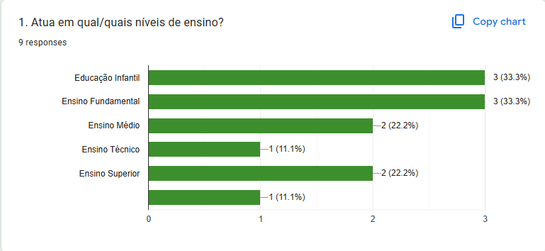
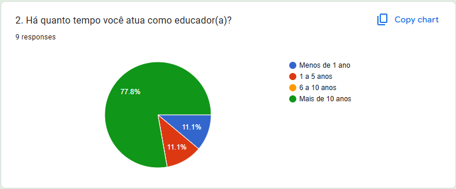
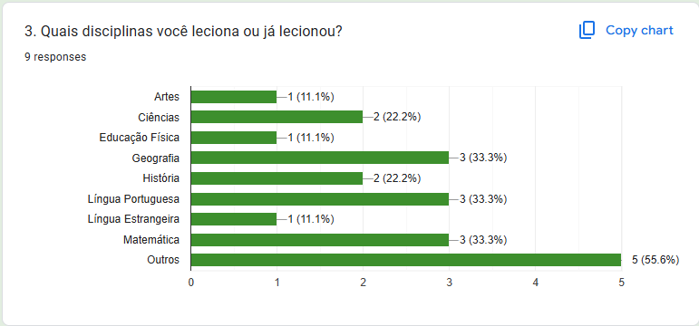
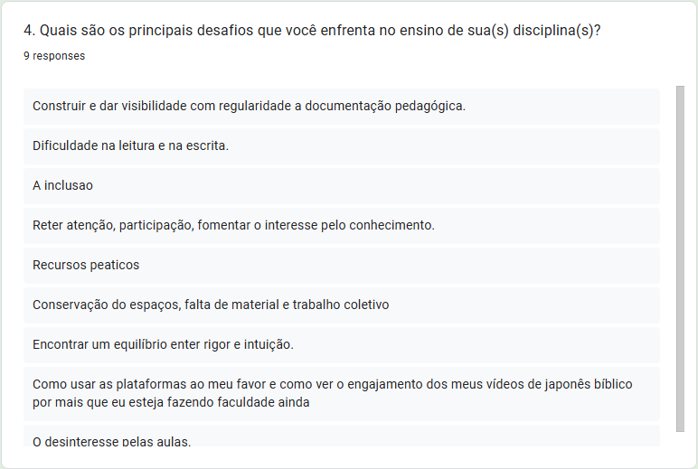
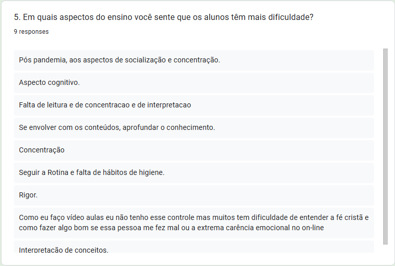
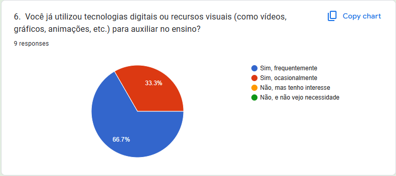
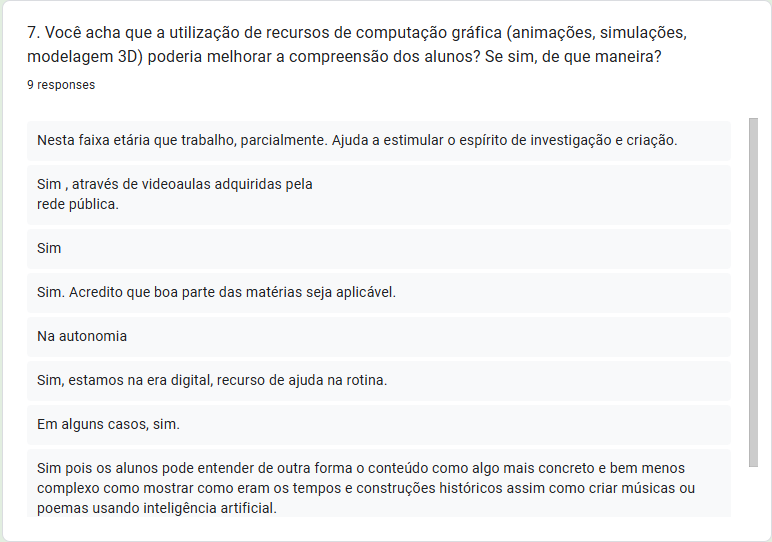
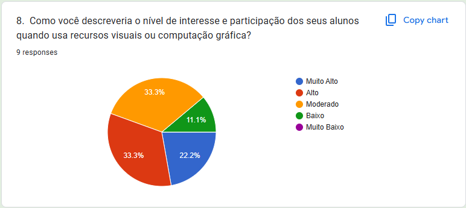
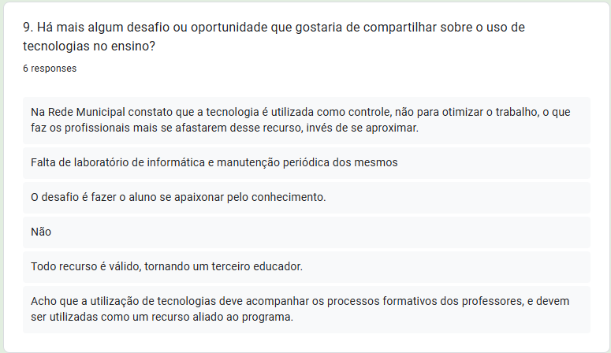

# Treinamento de atenção seletiva através de jogo 3D

- Lorena Silva Sampaio - 11201812025
- Pablo Renato Nunes dos Santos - 11202232225
- Jonas de Mello Oliveira - 11000116


Este projeto apresenta o jogo/aplicação 3D **Voo dos Pássaros**, uma ferramenta desenvolvida após uma série de entrevistas empáticas com professores e com uma profissional da neuropsicologia. Sua finalidade é treinar habilidades de atenção e concentração dos jogadores, desafiando-os a identificar e coletar objetos específicos em meio a um ambiente visual dinâmico (no caso, pássaros brancos).

O repositório contém o código desenvolvido em C++ com OpenGL, SDL e ImGui. Na aplicação, o usuário precisa capturar os alvos corretos (pássaros brancos) enquanto evita o contato com objetos de distração (pássaros não brancos). 
Cada pássaro branco que atinge o cesto aumenta a pontuação, enquanto atingir uma distração diminui a pontuação. O objetivo é conseguir a maior pontuação possível antes do tempo acabar.

## Tabela de Conteúdos

- [Motivação do Projeto](#motivação-do-projeto)
  - [Entrevistas com Educadores](#entrevistas-com-educadores)
  - [Consultoria Neuropsicológica](#consultoria-neuropsicológica)
- [Aspectos do Jogo](#aspectos-do-jogo)
- [Estrutura do Código](#estrutura-do-código)
- [Funcionalidades](#funcionalidades)
- [Técnicas Implementadas](#técnicas-implementadas)
  - [Interface de Usuário com ImGui](#interface-de-usuário-com-imgui)
  - [Interação do Usuário com SDL](#interação-do-usuário-com-sdl)
  - [Controle de Tempo e Estado do Jogo](#controle-de-tempo-e-estado-do-jogo)
  - [Renderização de Objetos com OpenGL](#renderização-de-objetos-com-opengl)
- [Avaliação do Projeto e Possíveis Melhorias](#avaliação-do-projeto-e-possíveis-melhorias)
- [Instalação e Execução](#instalação-e-execução)
- [Referências](#referências)

## Motivação do Projeto

O projeto é uma continuação em 3D do projeto originado na Atividade 1 (Treinamento de Atenção Seletiva), que foi desenvolvido em 2D, e que já havia passado por uma evolução na Atividade 2. A motivação do tema do jogo foi baseada em **entrevistas empáticas** realizadas com professores via Google Forms, que apontaram a falta de atenção e concentração como maior dificuldade enfrentada no ambiente escolar.

### Entrevistas com educadores

Nove educadores responderam nosso formulário, para muitos deles, a **falta de atenção e concentração** é a maior dificuldade enfrentada no ambiente escolar. Diante disso, ficou evidente a necessidade de criar uma ferramenta que auxiliasse no treinamento e desenvolvimento dessas habilidades cognitivas em um contexto interativo. Abaixo as respostas obtidas:











### Consultoria Neuropsicológica

Para validar a proposta, uma neuropsicóloga especializada em treinamento cognitivo foi entrevistada e sugeriu uma série de ideias para o desenvolvimento do jogo, resumidas abaixo:
- **Mecânica de Memória e Atenção**: Sugeriu-se que o jogo combinasse elementos de memória, concentração e percepção visual, com o objetivo de manter o jogador focado em uma tarefa específica enquanto é desafiado por distrações.
- **Progressão por Níveis**: A neuropsicóloga recomendou que o jogo apresentasse desafios progressivos, onde o número de objetos e distrações aumentasse em cada nível, dificultando o reconhecimento dos objetos a serem coletados.
- **Objetos Únicos e Distrações Dinâmicas**: Outro ponto foi a inclusão de objetos que aparecem apenas uma vez em certos níveis, incentivando o jogador a desenvolver uma atenção seletiva para identificar rapidamente o que é relevante em meio a uma grande quantidade de estímulos visuais.

Então, pensou-se em um jogo onde o jogador tem que se focar em uma tarefa específica, enquanto precisa evitar as distrações.  Essas sugestões foram simplificadas em um mvp (mínimo produto viável) e incorporadas ao projeto, dando origem ao **Caça ao Pombo Branco** na Atividade 1, e **Voo dos Pássaros** nas Atividades 2 e 3.

## Aspectos do jogo

O jogo foi modelado como uma caça ao pássaro, no qual o jogador deve capturar os pássaros brancos enquanto tenta evitar os pássaros de outra cor. Ele inclui um contador de tempo, um sistema de pontuação - um ponto por pássaro certo, menos um por pássaro errado -, e estados de jogo (início, jogando, vitória e game over).

A versão do jogo entregue na atividade A3 apresenta uma imagem de fundo representando um ambiente natural, com vários pássaros vindo em sua direção de maneira similar ao efeito _starfield_, e há um cesto de captura que você deve guiar para capturar os pássaros brancos enquanto evita os outros, no prazo de trinta segundos. Para movimentar o cesto você deve clicar nele com o mouse, e então movimentá-lo com as setas do teclado. Há um mostrador que mostra sua pontuação e o tempo restante, e também um menu no canto superior direito que permite mudar o diâmetro do cesto e o ângulo de visão.

## Funcionalidades

- **Treinamento de Atenção**: Foco em movimentar o cesto até um alvo correto (um objeto 3D) que se movimenta em um espaço 3D, enquanto evitar esbarrar nos objetos incorretos.
- **Contador de Tempo**: O usuário tem tempo limitado para acumular a maior pontuação possível.
- **Sistema de Pontuação**: A pontuação aumenta ao clicar no alvo correto e diminui ao clicar nas distrações.
- **Estados do Jogo**: Início, jogando, vitória e game over.

## Estrutura do Código

- **`main.cpp`**: Arquivo principal responsável pela inicialização do jogo e da interface gráfica.
- **`window.cpp`**: Gerencia a configuração da janela e a renderização dos elementos do jogo.
- **`window.hpp`**: Define a classe `Window`, que controla a janela do jogo e suas interações.
- **`model.cpp`**: Gerencia a renderização dos modelos 3D do jogo.
- **`model.hpp`**: Define a classe `Model`, que carrega e renderiza os modelos 3D.
- **`game_objects.cpp`**: Gerencia a renderização e interação dos objetos do jogo.
- **`game_objects.hpp`**: Define as classes que representam os objetos do jogo (alvo e distrações).
- **`gamedata.hpp`**: Define a estrutura `GameData`, que armazena os estados e informações relevantes do jogo.
- 	**`trackball.hpp`**: Define a classe `Trackball`, que implementa o trackball virtual.
- **`trackball.cpp`**: Gerencia a rotação dos elementos, como o cesto que muda de ângulo conforme o movimento.
- pasta **`assets`**: Contém os modelos dos objetos do jogo (pássaros, cesto)
- pasta **`shaders`**: Contém os *shaders* de vértice e de fragmento.
- pasta **`cube`**: Contém as imagens que formam o cenário.

## Técnicas Implementadas

O desenvolvimento se deu com várias técnicas de computação gráficas explicitadas abaixo:

### Interface de Usuário com ImGui

Na interface do usuário (UI), foi usada a biblioteca **ImGui** para mostrar os dados de:
- **Pontuação e Tempo**: Um contador de tempo e pontuação são exibidos na tela, atualizados em tempo real, ajudando o jogador a acompanhar seu progresso.
- **Estados do Jogo**: Mensagens informativas são exibidas dependendo do estado do jogo:
  - **Start**: Orienta o jogador a pegar o alvo correto.
  - **Playing**: Exibe o tempo e a pontuação enquanto o jogo está ativo.
  - **Game Over**: Mostra a pontuação final quando o tempo acaba. 
  - **Win**: Exibe uma mensagem de vitória se o jogador atingir uma nova pontuação recorde. //Esse estado ainda apresenta bugs para ser apresentado.

### Interação do Usuário com SDL

Para detectar cliques do mouse e toques na tela, o jogo utiliza a biblioteca **SDL**:
- **SDL_MOUSEBUTTONDOWN** e **SDL_FINGERDOWN**: Eventos capturam a posição de cliques e toques, permitindo que o jogador interaja com o jogo.
- **Configurações**: o mouse permite alterar o diâmetro do cesto e mudar o ângulo de visão, além de liberar a movimentação do cesto.
- **Conversão de Coordenadas**: Os toques nas setas direcionais do teclado alteram as coordenadas do cesto, permitindo uma fácil verificação de colisão entre o clique e os objetos na tela.
- **Interatividade**: Ao atingir no alvo correto, a pontuação aumenta, enquanto atingir em uma distração resulta em perda de pontos.
- **Colisões**: A função `checkCollision()` verifica se a posição do cesto corresponde à posição do alvo, permitindo que o jogador colete o alvo e altere sua pontuação.
- **Transformações**: As posições dos objetos são recalculadas periodicamente, com posições aleatórias a cada nova rodada, utilizando-se diversas funções.

### Controle de Tempo e Estado do Jogo

O estado do jogo e o cronômetro são geridos utilizando a biblioteca **chrono** do C++:
- **Cronômetro**: Cada segundo, o tempo é decrementado. Ao atingir zero, o jogo termina.
- **Estados do Jogo**: São definidos vários estados (Start, Playing, Game Over, Win) que determinam a lógica e as mensagens exibidas ao jogador. A função `checkGameStatus()` atualiza o estado com base na pontuação e tempo restantes.
- **Pontuação**: A pontuação é atualizada com base nas capturas corretas e incorretas do jogador, aumentando ou diminuindo a pontuação conforme necessário.

### Renderização de Objetos com OpenGL

A renderização é feita usando **OpenGL**:

- **Shaders (texture.vert e texture.frag)**: O projeto utiliza o código de shaders "textura" baseado no viewer6 do material das aulas.

	1. **Blinn-Phong**: O programa de shader utilizado implementa um sistema de sombreamento usando o modelo Blinn-Phong para iluminação.

	2. **Mapeamento de Textura**: Utiliza-se também o mapeamento de textura em GLSL (OpenGL Shading Language). 

	3. **Vertex Shader**: No vertex shader, as informações do vértice, como posição, normais e coordenadas de textura, são transformadas usando as matrizes modelo, visão e projeção, além de calcular vetores úteis para iluminação (como o vetor luz e o vetor para o observador). 

	4. **Fragment Shader**: As informações do vertex sahder são repassadas ao fragment shader para computar a cor de cada fragmento. Nesse, a iluminação é calculada usando o modelo Blinn-Phong, que considera componentes de luz ambiente, difusa e especular. Além disso, ele permite o uso de diferentes coordenadas de textura (planejamento, cilíndrico, esférico ou mapeamento da malha) que não aplicamos nesse projeto. 

	5. **Resultado**: O resultado é uma combinação de textura e iluminação física para gerar a cor final de cada pixel vista nos objetos (modelos de pássaro).

- **Modelo (model.hpp e model.cpp)**: O código manipula modelos 3D (.obj) com texturas e materiais (.mtl) para renderizar objetos 3D.

	1. **Definição de Vértices e Índices**: Os vértices contêm posição, normais e coordenadas de textura. A estrutura de hash otimiza a busca por vértices únicos.

	2. **Cálculo de Normais**: Computa as normais dos vértices acumulando normais de suas faces adjacentes (através do produto vetorial de arestas). Normais acumuladas são normalizadas para garantir consistência.

	3. **Cálculo de Tangentes**: Computa tangentes e bitangentes com base nas coordenadas de textura. As tangentes são reortogonalizadas em relação às normais para evitar distorções.

	4. **Carregamento de Arquivos OBJ**: Usa `tinyobjloader` para processar modelos OBJ. Gera vértices e índices e configura propriedades como texturas difusas e parâmetros de material.

	5. **Centralização e Normalização**: Redimensiona o modelo para que caiba em um cubo unitário e centraliza-o na origem, facilitando sua manipulação no espaço 3D.

	6. **Buffers (VBO, EBO, VAO)**:
		- **`createBuffers`**: Cria e preenche os buffers de vértices e índices.
		- **`setupVAO`**: Configura os atributos de vértice no Vertex Array Object (VAO), incluindo posição, normais, tangentes e coordenadas de textura.

	7. **Carregamento de Texturas**: **`loadDiffuseTexture`**: Carrega uma textura difusa (imagem) para aplicação nos modelos. 

	8. **Renderização**: **`render`**: Renderiza o modelo configurando a textura, ativando o VAO e chamando `glDrawElements` para desenhar os triângulos.

	9. **Destruição**: Libera recursos como texturas, buffers e VAO quando o objeto é destruído.

- **Objetos do Jogo (game_objects.hpp e game_objects.cpp)**: O código gerencia a renderização e interação dos objetos do jogo.

	1. **Estrutura Principal**
Objetos do jogo são representados por dois grupos:
	    - **`m_distractionObjects`**: Objetos que distraem o jogador (pássaros com penas azuis).
	    - **`m_targetObjects`**: Objetos que o jogador deve focar (pássaros com penas brancas).    
		- **Shaders:** O programa de sombreamento (`m_program`) é configurado para aplicar texturas e iluminação aos objetos.
		- **Modelos 3D:** Os modelos de distração e alvo são carregados a partir de arquivos .obj e associados às texturas.

	2. **Geração e Atualização de Objetos**
		- **`setupSceneObjects`**: Inicializa as posições e propriedades aleatórias dos objetos dentro de limites 3D definidos.
		- **`updateSceneObjects`**:    Atualiza a posição dos objetos com base no tempo (`deltaTime`) e velocidade. Se o objeto sair da área visível, ele é reposicionado aleatoriamente.

	3. **Renderização**
		- **`paint`**: Configura o ambiente de renderização, define variáveis uniformes para o shader e chama `renderObject` para desenhar os objetos na tela.
		- **`renderObject`**: Aplica transformações como translação, escala e rotação antes de renderizar cada objeto.

	4. **Interação do Usuário**
		- **`checkClickOnObject`**: Verifica se um clique do usuário atinge algum menu na tela, altera as configurações conforme o menu.
		- **`checkCollisionWithNet`**: Verifica se o cesto atinge algum objeto na tela. Converte as coordenadas do objeto para o espaço da tela e compara com a posição do cesto.     Reposiciona o objeto atingido.

	5. **Interface do Usuário**
		- **`paintUI`**: Cria uma interface gráfica usando ImGui para alterar o tipo de projeção (perspectiva ou ortográfica) e ajustar o campo de visão (baseado no projeto efeito Starfield do material das aulas).

- **Renderização de Janela (window.hpp e window.cpp)**: 

	1. **Configuração Inicial**
A cor de fundo é definida (skyblue) utilizando a função `glClearColor`. A fonte do texto é carregada a partir de um arquivo TTF. Objetos do jogo são inicializados, e o jogo começa no estado inicial (`GameState::Start`).

	2. **Lógica de Jogo**
		 - **Estados do Jogo**: O jogo pode estar nos estados Start, Playing, GameOver, ou Win.
		- **Tempo e Pontuação**: O temporizador decrementa a cada segundo enquanto o estado é Playing. A pontuação aumenta ou diminui com base em cliques corretos ou incorretos.
		- **Fim do Jogo**: O jogo termina (GameOver) quando o tempo chega a zero.
    Se a pontuação atual exceder o recorde anterior, o estado muda para Win.

	3. **Eventos de Interação**
		- **Clique do mouse**: Libera o movimento do cesto ou habilita as mudanças de configurações.
		- **Toques nas setas direcionais**: Movimentam o cesto

	4. **Renderização**
Renderiza os objetos do jogo e uma interface do usuário usando ImGui para exibir a pontuação e o tempo restante.

	5. **Reinicialização**
Funções como `resetGame()` e `startGame()` permitem reiniciar o jogo para o estado inicial, com objetos reposicionados aleatoriamente e variáveis reiniciadas.

## Avaliação do Projeto e Possíveis Melhorias

O objetivo da atividade, que era obter uma aplicação didática funcional com gráficos 3D, usando os padrões e conceitos do curso (OpenGL, ABCG, etc), foi alcançado. Alguns problemas foram notados, como a presença de _bugs_ ao executar o jogo em um dos computadores da sala de aula, enquanto que o computador ao lado executava sem problemas. Foi assumido que o problema estava na configuração do computador em questão. 
Possíveis melhorias para a aplicação podem incluir:
- **Controle do cesto pelo mouse**: Garantir maior agilidade e liberdade de movimento que as setas do teclado permitem.
- **Opções de tempo de jogo**: Permitir ao usuário escolher diversas opções de tempo.
- **Voo**: Eliminar a rotação dos modelos e gerar apenas o movimento das asas. 
- **Níveis de Dificuldade**: Implementar níveis de dificuldade progressivos, com mais objetos e distrações em níveis avançados.
- **Sons e Efeitos Visuais**: Adicionar efeitos sonoros e visuais para tornar o jogo mais imersivo e envolvente.
- **Feedback Visual**: Adicionar feedback visual para indicar acertos e erros.
- **Bugs**: Maior atenção com as compatibilidades requeridas para evitar situações de *bugs* em diferentes sistemas operacionais e configurações.
- **Reiniciar**: Adicionar um botão de reinício na tela após o término do jogo.

No entanto, boa parte dessas melhorias já vão além do conteúdo da disciplina, e já tornariam o aplicativo menos próximo de uma versão didática e mais próximo de uma versão comercial. Assim, tendo em vista o objetivo desejado, o grupo considerou o resultado final plenamente satisfatório.

## Instalação e Execução

Para compilar e executar o jogo:

1. Clone este repositório:
   ```bash
   git clone https://github.com/usuario/jogo-treinamento-atencao.git
   cd jogo-treinamento-atencao
    ```
2. Seguir as instruções de instalação encontradas em:
[Configuração do ambiente](https://hbatagelo.github.io/cg/config.html)

3. O jogo pode ser acessado pelo browser no link:
[WebAssembly do jogo](https://lorenypsum.github.io/abcg/attentiongame3d/)

## Vídeo de Gameplay
[Link do vídeo](https://drive.google.com/drive/folders/1Twt4VrN87Xa7bjZ_nGLe0jpwOSqIPjjB?usp=sharing)

## Referências
- [Bird Object](https://www.cgtrader.com/items/3816085/download-page)
- [Hbatagelo](https://hbatagelo.github.io/cg/)
- [OpenGL](https://www.opengl.org/)
- [SDL](https://www.libsdl.org/)
