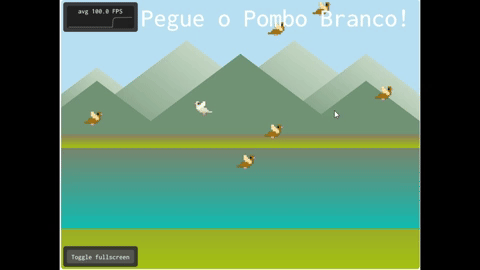
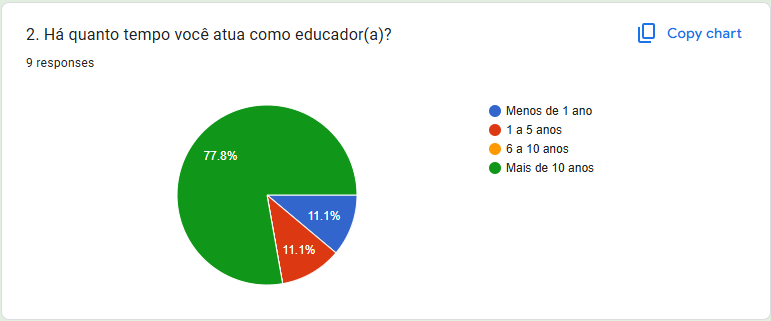

# Jogo de Treinamento de Habilidade de Atenção

 <!-- Substitua com o link para o GIF -->

Este projeto apresenta o jogo **Caça ao Pombo**, uma ferramenta desenvolvida após uma série de entrevistas empáticas com professores e com uma profissional da neuropsicologia, sua finalidade é treinar habilidades de atenção e concentração dos jogadores, desafiando-os a identificar e coletar objetos específicos em meio a um ambiente visual dinâmico.

O ambiente do jogo, embora simule aleatoriedade, permanece constante para permitir testes comparativos de atenção entre jogadores. Isso possibilita o uso dos resultados em análises de desempenho e evolução de habilidades, viabilizando sua aplicação em experimentos científicos.

O repositório contém o código desenvolvido em C++ com OpenGL, SDL e ImGui. No jogo, o jogador precisa clicar no alvo correto (pombo branco) enquanto evita clicar em objetos de distração (pombos marrons). Cada acerto no alvo aumenta a pontuação, enquanto clicar em uma distração diminui a pontuação. O objetivo é conseguir a maior pontuação possível antes do tempo acabar.

## Tabela de Conteúdos

- [Motivação do Projeto](#motivação-do-projeto)
  - [Entrevistas com Educadores](#entrevistas-com-educadores)
  - [Consultoria Neuropsicológica](#consultoria-neuropsicológica)
- [Objetivo e Justificativa](#objetivo-e-justificativa)
- [Funcionalidades](#funcionalidades)
- [Técnicas Implementadas](#técnicas-implementadas)
  - [Renderização de Objetos com OpenGL](#renderização-de-objetos-com-opengl)
  - [Interface de Usuário com ImGui](#interface-de-usuário-com-imgui)
  - [Interação do Usuário com SDL](#interação-do-usuário-com-sdl)
  - [Controle de Tempo e Estado do Jogo](#controle-de-tempo-e-estado-do-jogo)
  - [Estrutura do Código](#estrutura-do-código)
  - [Melhorias Futuras](#melhorias-futuras)
  - [Correções Necesárias](#correções-necesárias)
- [Instalação e Execução](#instalação-e-execução)
- [Estrutura do Código](#estrutura-do-código)
- [Referências](#referências)

## Motivação do Projeto

A escolha do tema do jogo foi baseada em **entrevistas empáticas** realizadas via Google Forms, onde foram levantadas as principais dificuldades enfrentadas por professores em sala de aula, após o resultado, uma consulta foi realizada com uma neuropsicóloga especializada em desenvolvimento de habilidades cognitivas. 

### Entrevistas com Educadores

Nove educadores responderam nosso formulário, para muitos deles, a **falta de atenção e concentração** é a maior dificuldade enfrentada no ambiente escolar. Diante disso, ficou evidente a necessidade de criar uma ferramenta que auxiliasse no treinamento e desenvolvimento dessas habilidades cognitivas em um contexto interativo.

### Resultados das Entrevistas




### Consultoria com Neuropsicológica

Para validar a proposta, uma neuropsicóloga especializada em treinamento cognitivo foi entrevistada e sugeriu uma série de ideias para o desenvolvimento do jogo, resumidas abaixo:
- **Mecânica de Memória e Atenção**: Sugeriu-se que o jogo combinasse elementos de memória, concentração e percepção visual, com o objetivo de manter o jogador focado em uma tarefa específica enquanto é desafiado por distrações.
- **Progressão por Níveis**: A neuropsicóloga recomendou que o jogo apresentasse desafios progressivos, onde o número de objetos e distrações aumentasse em cada nível, dificultando o reconhecimento dos objetos a serem coletados.
- **Objetos Únicos e Distrações Dinâmicas**: Outro ponto foi a inclusão de objetos que aparecem apenas uma vez em certos níveis, incentivando o jogador a desenvolver uma atenção seletiva para identificar rapidamente o que é relevante em meio a uma grande quantidade de estímulos visuais.

Essas sugestões foram simplificadas em um mvp (mínimo produto viável) e incorporadas ao projeto, dando origem ao **Caça ao Pombo Branco!**.

## Objetivo e Justificativa

O objetivo deste projeto é desenvolver um jogo que **treine ou avalie a atenção e concentração** dos jogadores, desafiando-os a identificar e coletar objetos específicos em uma tela lotada de distrações. O escopo foi simplificado para um jogo de atenção básico, onde o jogador deve clicar no alvo correto (pombo branco) enquanto evita clicar em objetos de distração (pombos marrons).

## Funcionalidades

- **Treinamento de Atenção**: Foco no alvo correto enquanto evita distrações em um cenário dinâmico.
- **Contador de Tempo**: O jogador tem tempo limitado para acumular a maior pontuação possível.
- **Sistema de Pontuação**: A pontuação aumenta ao clicar no alvo correto e diminui ao clicar nas distrações.
- **Estados do Jogo**: Início, jogando, vitória e game over.

## Técnicas Implementadas

O desenvolvimento se deu com várias técnicas de computação gráficas explicitadas abaixo:

### Renderização de Objetos com OpenGL

A renderização é feita usando **OpenGL**:
- **Shaders**: O código utiliza shaders de vértices e fragmentos, localizados no diretório `shaders`, para processar a textura dos objetos e garantir uma renderização leve e responsiva.
- **Texturas**: São carregadas texturas de pombo branco (alvo) e pombo marrom (distração) para dar contexto ao jogo. SDL_image.h é usado para carregar as imagens em png.
- **Transformações**: As posições dos objetos são recalculadas periodicamente, com posições aleatórias a cada nova rodada, utilizando-se diversas funções.
- **Colisões**: A função `checkCollision()` verifica se a posição do clique corresponde à posição do alvo, permitindo que o jogador colete o alvo correto e aumente sua pontuação.
- **Renderização de Cenário**: O cenário é renderizado com um fundo de céu e nuvens, criando um ambiente visual agradável e imersivo.
- **Renderização de Objetos**: Os objetos (alvo e distrações) são renderizados com texturas e posições aleatórias, desafiando o jogador a manter o foco no alvo correto.
- **Renderização de UI**: A interface do usuário é renderizada com **ImGui**, exibindo informações sobre a pontuação, tempo e estado do jogo.

### Interface de Usuário com ImGui

Para a interface do usuário (UI), **ImGui** é usado:
- **Pontuação e Tempo**: Um contador de tempo e pontuação são exibidos na tela, atualizados em tempo real, ajudando o jogador a acompanhar seu progresso.
- **Estados do Jogo**: Mensagens informativas são exibidas dependendo do estado do jogo:
  - **Start**: Orienta o jogador a pegar o alvo correto.
  - **Playing**: Exibe o tempo e a pontuação enquanto o jogo está ativo.
  - **Game Over**: Mostra a pontuação final quando o tempo acaba. 
  - **Win**: Exibe uma mensagem de vitória se o jogador atingir uma nova pontuação recorde. //Esse estado ainda apresenta bugs para ser apresentado.

### Interação do Usuário com SDL

Para detectar cliques do mouse e toques na tela, o jogo utiliza **SDL**:
- **SDL_MOUSEBUTTONDOWN** e **SDL_FINGERDOWN**: Eventos capturam a posição de cliques e toques, permitindo que o jogador interaja com o jogo.
- **Conversão de Coordenadas**: As posições de clique são convertidas para coordenadas normalizadas, permitindo uma fácil verificação de colisão entre o clique e os objetos na tela.
- **Interatividade**: Ao clicar no alvo correto, a pontuação aumenta, enquanto clicar em uma distração resulta em perda de pontos.

### Controle de Tempo e Estado do Jogo

O estado do jogo e o cronômetro são geridos utilizando a biblioteca **chrono** do C++:
- **Cronômetro**: Cada segundo, o tempo é decrementado. Ao atingir zero, o jogo termina.
- **Estados do Jogo**: São definidos vários estados (Start, Playing, Game Over, Win) que determinam a lógica e as mensagens exibidas ao jogador. A função `checkGameStatus()` atualiza o estado com base na pontuação e tempo restantes.
- **Pontuação**: A pontuação é atualizada com base nos cliques corretos e incorretos do jogador, aumentando ou diminuindo a pontuação conforme necessário.

## Estrutura do Código

- **`main.cpp`**: Arquivo principal responsável pela inicialização do jogo e da interface gráfica.
- **`window.cpp`**: Gerencia a configuração da janela e a renderização dos elementos do jogo.
- **`window.hpp`**: Define a classe `Window`, que controla a janela do jogo e suas interações.
- **`distraction_objects.cpp`**: Implementa a classe `DistractionObject`, que representa os objetos de distração dentro do jogo.
- **`distraction_objects.hpp`**: Declara a classe `DistractionObject`, responsável por modelar os objetos que distraem o jogador.
- **`target_objects.cpp`**: Implementa a classe `TargetObject`, que representa o alvo que os jogadores devem coletar.
- **`target_objects.hpp`**: Declara a classe `TargetObject`, responsável por modelar os alvos a serem coletados pelos jogadores.
- **`background.cpp`**: Implementa a classe `Background`, que se encarrega de renderizar o cenário do jogo.
- **`background.hpp`**: Declara a classe `Background`, que define os parâmetros para a renderização do cenário.
- **`gamedata.hpp`**: Define a estrutura `GameData`, que armazena os estados e informações relevantes do jogo.	

### Melhorias Futuras
- **Níveis de Dificuldade**: Implementar níveis de dificuldade progressivos, com mais objetos e distrações em níveis avançados.
- **Sons e Efeitos Visuais**: Adicionar efeitos sonoros e visuais para tornar o jogo mais imersivo e envolvente.
- **Feedback Visual**: Adicionar feedback visual para indicar acertos e erros.

### Correções Necesárias
- **Corrigir Bug de Vitória**: O estado de vitória não está sendo exibido corretamente ao atingir uma nova pontuação recorde.
- **Corrigir Resete de Pontuação**: A pontuação não é resetada corretamente ao reiniciar o jogo.
- **Corrigir Bug de Interface**: A interface do usuário pode ser aprimorada para tornar o jogo mais intuitivo e fácil de usar.

## Instalação e Execução

Para compilar e executar o jogo:

1. Clone este repositório:
   ```bash
   git clone https://github.com/usuario/jogo-treinamento-atencao.git
   cd jogo-treinamento-atencao
    ```
2. Seguir as instruções de instalação encontradas em:
[Configuração do ambiente](https://hbatagelo.github.io/cg/config.html)

3. O jogo pode ser acessado pelo browser no link:
[WebAssembly do jogo](https://lorenypsum.github.io/abcg/attentiontraining/)

## Video de Gameplay
[Link do vídeo](https://drive.google.com/drive/folders/1Twt4VrN87Xa7bjZ_nGLe0jpwOSqIPjjB?usp=sharing)

## Referências
- [Pigeon Assets](https://pop-shop-packs.itch.io/)
- [Hbatagelo](https://hbatagelo.github.io/cg/)
- [OpenGL](https://www.opengl.org/)
- [SDL](https://www.libsdl.org/)
- [Chat GPT](https://www.chatgpt.com/)
- [Reddit](https://www.reddit.com/r/opengl/comments/1910otm/possible_to_use_sdl_image_to_load_in_opengl/?rdt=43070)
- [Stack Overflow](https://stackoverflow.com/questions/52895444/c-image-loading-with-sdl2-and-sdl-image)
- [Stack Overflow](https://stackoverflow.com/questions/74577979/how-to-idiomatically-add-external-library-dependencies-that-use-git-and-cmake-to)


